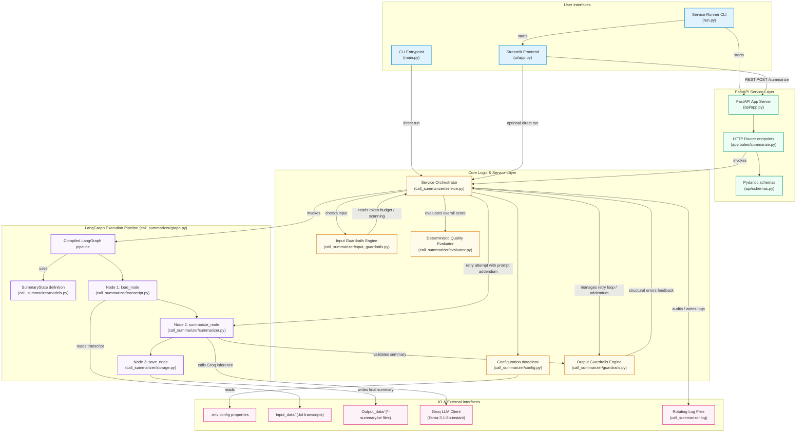

# Project Architecture Diagram

This document provides a detailed layout of the **Insurance Call Summariser Agent** architecture. It maps the interfaces, service boundaries, LangGraph execution nodes, guardrails, and file flows to show how the components interact.

## Architectural Diagram

Here is a visual mapping of the system components and their relationships:

## Detailed Component Reference

### UI Layer
*   [run.py](file:///f:/bright%20beam_final/Call_summarizer_agent/run.py) starts FastAPI (port 8000) and Streamlit (port 8501) as concurrent processes, capturing termination inputs (`Ctrl+C`).
*   [ui/app.py](file:///f:/bright%20beam_final/Call_summarizer_agent/ui/app.py) handles the 3-step Streamlit web application dashboard (upload, preview validation results, edit/save).
*   [main.py](file:///f:/bright%20beam_final/Call_summarizer_agent/main.py) provides a direct terminal execution path for batch processing.

### API Layer
*   [api/app.py](file:///f:/bright%20beam_final/Call_summarizer_agent/api/app.py) mounts CORS origins and coordinates service lifecycle events.
*   [api/schemas.py](file:///f:/bright%20beam_final/Call_summarizer_agent/api/schemas.py) validates client payloads using [SummaryRequest](file:///f:/bright%20beam_final/Call_summarizer_agent/api/schemas.py) and [SummaryResponse](file:///f:/bright%20beam_final/Call_summarizer_agent/api/schemas.py).
*   `api/routes/summarize.py` manages endpoint routing for the REST layer.

### Core Processing Layer
*   [call_summarizer/service.py](file:///f:/bright%20beam_final/Call_summarizer_agent/call_summarizer/service.py) orchestrates the execution. It handles:
    1. Running input validation via input guardrails.
    2. Invoking the LangGraph pipeline.
    3. Executing the automatic retry loop (up to 2 times) with feedback corrections if Tier-1 structural output guardrails fail.
    4. Saving summaries and running final evaluations.
*   [call_summarizer/input_guardrails.py](file:///f:/bright%20beam_final/Call_summarizer_agent/call_summarizer/input_guardrails.py) checks input safety:
    *   **Tier 1**: Token budget validation (blocks if > 19,708 characters).
    *   **Tier 2**: OWASP prompt injection scanner (blocks on malicious sequences).
    *   **Tier 3**: GDPR PII audit (scans for emails, IBANs, phone numbers, postcodes; logs only).
*   [call_summarizer/guardrails.py](file:///f:/bright%20beam_final/Call_summarizer_agent/call_summarizer/guardrails.py) checks output compliance:
    *   **Tier 1 (Structural)**: Missing headers or format schemas (blocks saving and triggers auto-retry).
    *   **Tier 2 (Format)**: Length and styling anomalies (warning only).
    *   **Tier 3 (Content)**: Verification of amounts, references, and IBANs against source transcript.
*   [call_summarizer/evaluator.py](file:///f:/bright%20beam_final/Call_summarizer_agent/call_summarizer/evaluator.py) performs post-generation evaluation scoring across 8 dimensions (factual grounding, completeness, formatting, hallucinations, professionalism, readiness, section relevance, and redundancy).

### LangGraph Pipeline
*   [call_summarizer/graph.py](file:///f:/bright%20beam_final/Call_summarizer_agent/call_summarizer/graph.py) structures node transitions on a linear graph (`load` ──► `summarize` ──► `save`).
*   [call_summarizer/transcript.py](file:///f:/bright%20beam_final/Call_summarizer_agent/call_summarizer/transcript.py) loads files into pipeline memory.
*   [call_summarizer/summarizer.py](file:///f:/bright%20beam_final/Call_summarizer_agent/call_summarizer/summarizer.py) queries the LLM.
*   [call_summarizer/storage.py](file:///f:/bright%20beam_final/Call_summarizer_agent/call_summarizer/storage.py) persists findings to disk.
